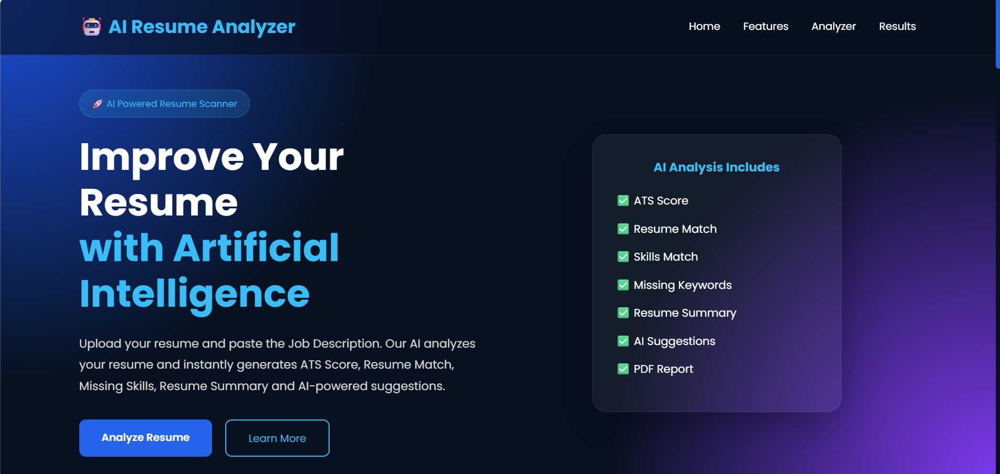

# 🤖 AI Resume Analyzer

An AI-powered Resume Analyzer that compares a resume against a job description using Google Gemini AI and provides ATS-style analysis, skill matching, and resume improvement suggestions.

---

## 📌 Project Overview

The **AI Resume Analyzer** is a practical AI automation project designed to help job seekers evaluate how well their resume matches a specific job description.

The application accepts a resume and a job description, sends the submitted data to an **n8n workflow**, processes the information using **Google Gemini AI**, and returns structured resume analysis results to the frontend.

The project demonstrates how a web application can be connected to an AI-powered automation workflow using REST APIs and webhooks.

---

## 🎯 Problem Statement

Job seekers often need to compare their resume with different job descriptions to identify:

- Whether their skills match the role
- Which skills are missing
- What strengths their resume contains
- What areas need improvement
- Which keywords are relevant to the target job
- How closely their resume matches the job requirements

Manually performing this analysis for every job application can be time-consuming.

This project automates that initial analysis using **n8n and Google Gemini AI**.

---

## 💡 Solution

The system allows a user to:

1. Upload a resume.
2. Enter a job description.
3. Submit the information to the backend workflow.
4. Process the resume and job description using Google Gemini AI.
5. Generate structured analysis results.
6. Display the results through the web interface.
7. Generate a PDF report containing the analysis.

---

## ✨ Features

- 📄 Resume Upload
- 📝 Job Description Input
- 🤖 AI-powered Resume Analysis
- 📊 ATS-style Score
- 🎯 Resume vs Job Description Matching
- 🧩 Skills Match Analysis
- ❌ Missing Skills Identification
- 💪 Strengths Identification
- ⚠️ Weakness Analysis
- 💡 Resume Improvement Suggestions
- 🔑 Relevant Keyword Suggestions
- 📋 Resume Summary
- 🎓 Experience Level Analysis
- 📑 PDF Report Generation
- ⚡ Automated AI Processing using n8n and Google Gemini

---

## 🏗️ System Architecture

```text
                         USER
                           │
                           ▼
              ┌─────────────────────────┐
              │      Web Interface      │
              │   HTML + CSS + JS       │
              └────────────┬────────────┘
                           │
                           │ Resume +
                           │ Job Description
                           ▼
              ┌─────────────────────────┐
              │     REST API / Webhook  │
              └────────────┬────────────┘
                           │
                           ▼
              ┌─────────────────────────┐
              │      n8n Workflow       │
              │   Automation Backend    │
              └────────────┬────────────┘
                           │
                           ▼
              ┌─────────────────────────┐
              │    Google Gemini AI     │
              │       AI Analysis       │
              └────────────┬────────────┘
                           │
                           ▼
              ┌─────────────────────────┐
              │    Analysis Response    │
              └────────────┬────────────┘
                           │
                           ▼
              ┌─────────────────────────┐
              │   Frontend Dashboard    │
              │ Scores + Insights +     │
              │ Recommendations        │
              └─────────────────────────┘
```

---

## 🔄 Workflow

The application follows this general process:

```text
Resume + Job Description
          │
          ▼
       Frontend
          │
          ▼
     n8n Webhook
          │
          ▼
    Resume Processing
          │
          ▼
   Google Gemini AI
          │
          ▼
      AI Analysis
          │
          ▼
   Structured Response
          │
          ▼
    Results Dashboard
          │
          ▼
      PDF Report
```

---

## ⚙️ How It Works

### Step 1 — Resume Upload

The user selects a resume file through the web interface.

### Step 2 — Job Description

The user enters the job description for the position they are targeting.

### Step 3 — API Request

The frontend sends the resume and job description to the n8n webhook using a REST API request.

### Step 4 — AI Processing

The n8n workflow processes the submitted information and sends it to Google Gemini AI for analysis.

### Step 5 — Resume Analysis

The AI evaluates the resume against the provided job description and generates analysis results.

### Step 6 — Results

The frontend displays the generated analysis, including scores, matching skills, missing skills, strengths, weaknesses, and suggestions.

### Step 7 — PDF Report

The user can generate a PDF report containing the analysis results.

---

## 📊 Analysis Results

The system can generate the following information:

| Analysis | Description |
|---|---|
| Resume Score | Overall AI-generated evaluation of the resume |
| ATS-style Score | ATS-oriented evaluation based on the resume and job description |
| Skills Match | Percentage of identified matching skills |
| Matching Skills | Skills found in both the resume and job description |
| Missing Skills | Relevant skills identified in the job description but not in the resume |
| Strengths | Positive aspects identified in the resume |
| Weaknesses | Areas that may need improvement |
| Summary | AI-generated summary of the resume |
| Keywords | Relevant keywords for the target role |
| Suggestions | Recommended resume improvements |
| Experience Level | AI-estimated experience level |

> **Important:** The ATS-style score is an AI-generated analysis based on the provided resume and job description. It is not an official score from a commercial Applicant Tracking System.

---

## 🛠️ Tech Stack

### Frontend

- HTML5
- CSS3
- JavaScript (ES6)

### AI & Automation

- n8n
- Google Gemini AI

### API & Data

- REST APIs
- Webhooks
- JSON
- Multipart form data

### Deployment

- Vercel

---

## 🔌 API Integration

The frontend communicates with the n8n backend using an HTTP `POST` request.

The submitted data includes:

```text
resume
jobDescription
```

The resume is submitted as a file and the job description is submitted as form data.

The n8n workflow processes the request and returns the AI-generated analysis response to the frontend.

---

## 📥 Input

The application requires:

### Resume

A resume file uploaded by the user.

### Job Description

The job description for the position against which the resume should be evaluated.

Example:

```text
Job Title: AI Automation Intern

Requirements:
- n8n
- Workflow Automation
- REST APIs
- JSON
- Google Gemini
- Webhooks
- Basic programming knowledge
```

---

## 📤 Output

The system returns structured resume analysis that can include:

```text
Candidate Name
Resume Score
ATS-style Score
Skills Match
Matching Skills
Missing Skills
Strengths
Weaknesses
Suggestions
Keywords
Experience Level
Summary
```

---

## 📷 Screenshots

### AI Resume Analyzer Interface



---

## 📁 Project Structure

```text
ai-resume-analyzer-pro/
│
├── assets/
│   └── resume-analyzer.png
│
├── index.html
├── style.css
├── script.js
└── README.md
```

---

## 🧪 Testing

The project was tested using resume and job-description inputs to verify the main application flow.

### Test Areas

- Resume file upload
- Job description input
- Frontend validation
- API request
- n8n webhook communication
- AI processing
- Resume scoring
- Skills matching
- Missing skills detection
- Strengths and weaknesses
- Improvement suggestions
- Results rendering
- PDF report generation

---

## 🧩 Example Analysis

A typical analysis can contain results such as:

```text
Resume Score: 40
ATS-style Score: 39
Skills Match: 24%

Matching Skills:
- n8n
- Workflow Automation
- REST APIs
- JSON

Missing Skills:
- Python
- Node.js
- Database Knowledge
- Additional AI/API Tools

Strengths:
- AI automation project experience
- Workflow automation experience
- API integration experience

Improvement Suggestions:
- Add job-specific keywords
- Improve alignment with required skills
- Highlight relevant automation projects
```

> Example values are illustrative and may vary depending on the resume and job description submitted to the system.

---

## 🔐 Security Considerations

The Google Gemini API credentials are handled by the backend workflow rather than being exposed directly in the frontend.

The frontend communicates with the n8n webhook instead of directly exposing the Gemini API credential.

For a production-ready implementation, additional security measures could be added:

- API authentication
- Webhook authentication
- Rate limiting
- File-size restrictions
- File-type validation
- Improved error handling
- Abuse protection

---

## ⚠️ Current Limitations

The current implementation has some limitations:

- Analysis quality depends on the submitted resume and job description.
- AI-generated scores can vary between different inputs.
- ATS-style scoring does not represent the exact scoring algorithm of commercial ATS platforms.
- The backend webhook requires an available n8n workflow.
- Production deployments would require stronger API security and abuse protection.

---

## 🚀 Future Improvements

Potential improvements include:

- DOCX resume support
- Improved resume parsing
- More advanced ATS-style analysis
- Better keyword extraction
- Job-description skill categorization
- Secure API authentication
- Rate limiting
- Improved error handling
- More detailed resume recommendations
- Support for additional resume formats
- Production-ready backend infrastructure

---

## 🎓 Skills Demonstrated

This project demonstrates practical experience with:

- n8n workflow automation
- Google Gemini AI integration
- REST API integration
- Webhooks
- JSON data handling
- JavaScript
- Frontend-to-backend communication
- AI-powered text analysis
- Resume and job-description comparison
- AI-generated structured insights
- PDF report generation
- Vercel deployment

---

## 💼 Business Use Case

The project can be adapted for:

- Resume screening
- Candidate-job matching
- Recruitment automation
- HR screening workflows
- Resume improvement platforms
- Career assistance tools
- Job application preparation

A recruitment workflow could use a similar architecture to automatically evaluate candidate resumes against job requirements before human review.

---

## 📌 Project Status

**Status: Archived Project**

This project was built as a practical AI automation project to demonstrate the integration of:

```text
Web Interface
      ↓
REST API
      ↓
n8n Automation
      ↓
Google Gemini AI
      ↓
AI Analysis
      ↓
Results Dashboard
```

The project is maintained as a portfolio demonstration of AI automation and workflow integration.

---

## 👨‍💻 Author

### Priyanshu Saini

Aspiring AI Automation Engineer focused on workflow automation, AI integrations, APIs, and n8n.

**LinkedIn:**  
https://www.linkedin.com/in/priyanshusaini-ai/

**GitHub:**  
https://github.com/priyanshu-saini78

---

## ⭐ Project Highlights

```text
AI Resume Analysis
        +
Job Description Matching
        +
Google Gemini AI
        +
n8n Workflow Automation
        +
REST API Integration
        +
Web Interface
        +
PDF Reporting
```

---

## 📄 License

This project is intended for educational and portfolio demonstration purposes.